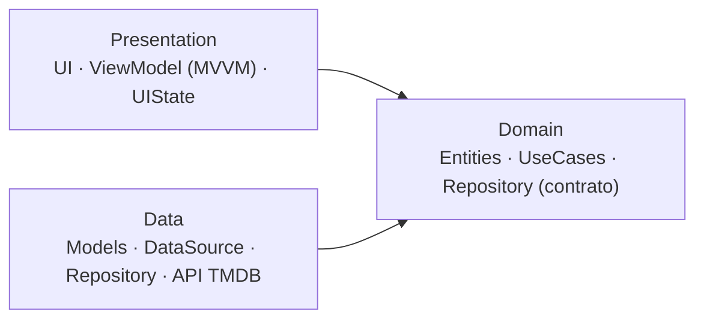

# Movies — App de Películas (TMDB)

App móvil en Flutter: catálogo de películas reales de TMDB (**Populares** y **Mejor
valoradas**), **buscador** con debounce y pantalla de **Detalle**, sobre un **design
system** reutilizable (estética tipo Netflix, dark).

## Tech stack

| Herramienta | Para qué se usa |
|---|---|
| **Flutter 3.38.6 / Dart 3.10.7** | Framework y lenguaje |
| **flutter_riverpod** | Manejo de estado (MVVM) e inyección de dependencias |
| **freezed** + **build_runner** | Modelos inmutables / uniones selladas + generación de código |
| **json_serializable** | (De)serialización JSON de los modelos |
| **dio** + **retrofit** | Cliente HTTP tipado hacia la API de TMDB |
| **fluro** | Rutas y navegación |
| **cached_network_image** | Carga y caché de imágenes (pósters / backdrops) |
| **flutter_dotenv** | Lee el token de TMDB desde `.env` (fuera de git) |
| **equatable** | Igualdad por valor de entidades y estados |
| **mockito** + **integration_test** | Dobles de prueba (codegen) y pruebas E2E |

## Arquitectura

**Clean Architecture** organizada *feature-first* (+ una capa `core/` transversal), con el
patrón **MVVM** en la capa de presentación. La dependencia siempre apunta hacia el dominio:



**Ventaja:** el **dominio no conoce** ni la UI ni la red. Eso hace el código fácil de
**testear** (se mockea en la frontera de cada capa) y de **escalar** (agregar features o
cambiar el origen de datos sin tocar el resto) — que era el requerimiento no funcional clave.

**MVVM:** cada pantalla tiene un ViewModel (`Notifier` de Riverpod) que expone un
`UIState<T>`; la vista solo **observa y renderiza**, sin lógica de negocio.

**Manejo de errores:** el repositorio **lanza** en caso de fallo; la presentación lo captura
(`try/catch`) y expone `UIState<T>` → **carga / éxito / error**. Un `ApiResponse` + un mixin
traducen los fallos de red (timeout, sin conexión, HTTP) a mensajes legibles, y cada pantalla
muestra sus estados de **carga**, **vacío** y **error** (con reintento).

## Cómo se desarrolló — Spec-Driven Development

Desarrollado con **Claude Code (modelo Claude Opus 4.7)** siguiendo **Spec-Driven
Development** (Spec Kit): la especificación guía el código, no al revés.

A partir de los **requerimientos funcionales y no funcionales** el trabajo se dividió en
**frentes**; cada frente se construyó como una *feature* con el **mismo flujo**:

```
spec  →  clarify  →  plan  →  tasks  →  implement  →  verificar  →  ADR
```

Es decir: se escribe la **especificación**, se resuelven **ambigüedades**, se **planifica**,
se **desglosa en tareas**, se **implementa**, se **verifica** que todo funciona y recién ahí
se documenta la decisión en un **ADR**; luego se testea y se pasa al siguiente frente.

| # | Frente | Motivado por | Documento |
|---|---|---|---|
| 001 | Arquitectura base | Requerimiento de **escalabilidad** | [ADR-001](documentacion/ADRs/ADR-001-arquitectura-de-la-app.md) |
| 002 | Integración con el servicio **TMDB** | Consumir datos reales | [ADR-002](documentacion/ADRs/ADR-002-integracion-tmdb.md) |
| 003 | **Design system** + pantallas | UI reutilizable (catálogo, búsqueda, detalle) | [ADR-003](documentacion/ADRs/ADR-003-design-system-y-pantallas.md) |
| 004 | Tests **unitarios + integración** | Calidad y no-regresión | [ADR-004](documentacion/ADRs/ADR-004-estrategia-de-testing.md) |

Las especificaciones de cada feature viven en `specs/`.

## Configuración (TMDB)

1. Crea una cuenta en [themoviedb.org](https://www.themoviedb.org) → **Settings → API**.
2. Copia tu **API Read Access Token** (v4, empieza con `eyJ...`).
3. Crea un archivo **`.env`** en la raíz (plantilla en `.env.example`):
   ```env
   TMDB_TOKEN=eyJ...
   ```
   El `.env` está en `.gitignore` (no se versiona).

## Ejecutar

```bash
flutter pub get
dart run build_runner build --delete-conflicting-outputs   # genera código (ver abajo)
flutter run
```

## Regenerar código

Genera `*.g.dart` (json_serializable / retrofit), `*.freezed.dart` (freezed) y
`test/helpers/mocks.mocks.dart` (mockito):

```bash
# Una vez
dart run build_runner build --delete-conflicting-outputs

# En modo watch (regenera al guardar)
dart run build_runner watch --delete-conflicting-outputs

# Limpiar salidas generadas
dart run build_runner clean
```

## Pantallas

- **Catálogo (Home):** filas de **Populares** y **Mejor valoradas** (póster + rating) con
  **scroll infinito** y una **barra de búsqueda** con **debounce de 400 ms**; al limpiar/volver
  se restaura el catálogo.
- **Detalle:** backdrop + póster + título + rating + géneros + sinopsis.

## Pruebas

```bash
# Unitarias (3 capas)
flutter test                                                               # toda la suite
flutter test --coverage                                                    # + reporte coverage/lcov.info
flutter test test/features/home/presentation/viewmodels/                   # solo una carpeta/archivo

# Integración / E2E (requieren emulador o dispositivo; ver `flutter devices`)
flutter test integration_test/flujos_integracion_mocks_test.dart -d <device>  # con datos simulados (mocks)
flutter test integration_test/flujos_e2e_real_test.dart -d <device>           # E2E real vs TMDB (+ .env)

# Análisis estático y formato
flutter analyze
dart format .
```

> Si cambiaste algún contrato mockeado, regenera los mocks antes de correr los tests
> (ver [Regenerar código](#regenerar-código)).

Dobles con **mockito**; las transiciones de estado se aseveran con
`container.listen(..., fireImmediately: true)`.

**Cobertura actual: 92.1% de la lógica** (66/66 pruebas verdes) — se excluye código
generado, UI y wiring de DI; la UI se valida por integración/E2E.

| Capa | Cobertura |
|---|---|
| Domain | 100.0% |
| Data | 82.9% |
| Presentation (ViewModels + estados) | 92.6% |
| Core / API | 93.8% |

Detalle de la estrategia en [ADR-004](documentacion/ADRs/ADR-004-estrategia-de-testing.md).

## Pendiente

Mejoras futuras: dominio de **Series** (`/tv/*`), **favoritos/watchlist** y empaquetar la
fuente Inter (hoy se usa la del sistema con la misma escala).
