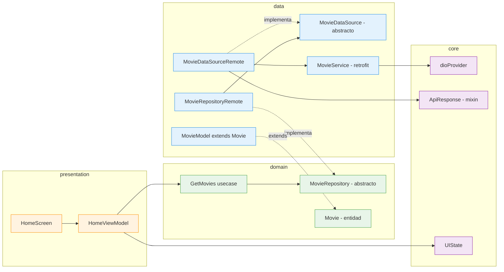
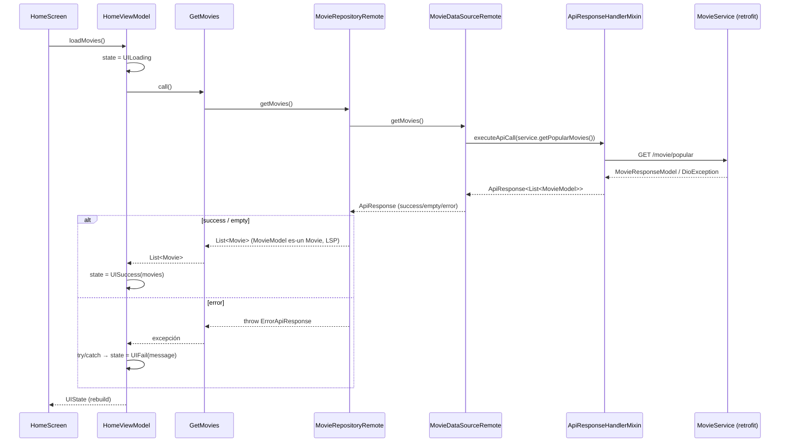
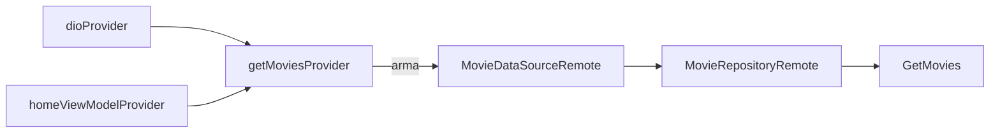

# ADR-001 — Arquitectura de la app de Películas/Series

- **Estado**: Aceptado
- **Fecha**: 2026-07-01
- **Contexto de la feature**: `specs/001-arquitectura-base`
- **Decisores**: Equipo mobile

---

## 1. Contexto

El ejercicio pide una app de Películas/Series **escalable**, consumiendo la API de TMDB, con
Riverpod, Freezed y Fluro como bibliotecas recomendadas. Antes de construir features reales
(listados Popular/Top Rated, detalle, buscador) se define y valida una **base arquitectónica**
que:

- separe responsabilidades por capas (Clean Architecture),
- sea replicable feature a feature,
- aísle el dominio de detalles de infraestructura (HTTP, serialización),
- y demuestre el flujo end-to-end con un arnés mínimo (botón en `home`).

## 2. Decisión

Adoptar **Clean Architecture feature-first** con tres capas (`data`, `domain`, `presentation`)
por feature, más una capa `core` transversal. La presentación sigue **MVVM** con Riverpod
(DI + estado, manual, sin codegen). El acceso a red se hace con **dio + retrofit** (cliente
autogenerado), la serialización con **json_serializable**, la navegación con **Fluro** y la
igualdad de valor con **Equatable**.

### 2.1 Regla de dependencia



> Las flechas apuntan **hacia adentro**: `presentation → domain ← data`. El **domain no importa**
> nada de `data` ni de `presentation`.

### 2.2 Flujo de datos end-to-end (botón "Verificar")



## 3. Estructura de carpetas

```text
lib/
├── main.dart                         # setup del router + ProviderScope
├── app.dart                          # MaterialApp con FluroRouter
├── navigation/                       # Routing global (fuera de core)
│   ├── app_router.dart               # FluroRouter; agrega rutas de features
│   └── route_paths.dart
├── core/                             # Transversal
│   ├── api/
│   │   ├── api_config.dart           # baseUrl + token (dart-define)
│   │   └── remote/
│   │       ├── dio_provider.dart     # Dio compartido
│   │       ├── api_response.dart      # ApiResponse<T> (sellada)
│   │       ├── api_response_handler_mixin.dart
│   │       └── api_logger.dart
│   └── state/
│       └── ui_state.dart             # UIState<T> (sellada, Dart puro)
└── features/home/
    ├── data/
    │   ├── datasources/
    │   │   ├── api/movie_service.dart        # retrofit @RestApi
    │   │   ├── movie_data_source.dart        # abstracto
    │   │   └── movie_data_source_remote.dart # remoto (mixin + service)
    │   ├── models/
    │   │   ├── movie_model.dart              # extends Movie + json
    │   │   └── movie_response_model.dart     # envoltura paginada TMDB
    │   └── repositories/
    │       └── movie_repository_remote.dart
    ├── domain/
    │   ├── entities/movie.dart               # Equatable
    │   ├── repositories/movie_repository.dart
    │   └── usecases/get_movies.dart
    └── presentation/
        ├── navigation/home_routes.dart
        ├── providers/home_providers.dart     # DI (Riverpod manual)
        ├── viewmodels/home_view_model.dart   # Notifier<UIState>
        └── ui/
            ├── home_screen.dart
            └── widgets/movie_tile.dart
```

## 4. Decisiones clave y justificación

| # | Decisión | Justificación | Alternativa descartada |
|---|----------|---------------|------------------------|
| D1 | **Clean Architecture feature-first** | Escalabilidad y aislamiento; cada feature replica el patrón | Layer-first global (peor cohesión por feature) |
| D2 | **Riverpod manual (sin codegen)** para DI y estado | Cubre DI + state management sin `get_it`; control explícito | `riverpod_generator` (descartado por preferencia); `get_it`+`provider` (2 deps) |
| D3 | **MVVM en presentation** con `Notifier` → `UIState<T>` | ViewModel invoca el caso de uso y expone estado exhaustivo | Estados ad-hoc con flags booleanos |
| D4 | **`UIState<T>` sellada en Dart puro** (no Freezed) | Clase madre + subclases; `switch` exhaustivo; sin codegen | Freezed union / `AsyncValue` |
| D5 | **Sin `Result`/`Failure`**: `ApiResponse<T>` en data + `throw` + try/catch en VM | Menos ceremonia; el manejo de red vive donde ocurre (mixin) | `Result<T>`/`Either` (capas extra) |
| D6 | **`MovieModel extends Movie` (LSP)** | El repositorio devuelve el modelo como entidad sin mapeo manual | Mapeo manual `toEntity()` / `auto_mappr` |
| D7 | **retrofit + json_serializable** (codegen) | Cliente HTTP tipado y (de)serialización automáticos | Llamadas dio manuales + parseo a mano |
| D8 | **Fluro** con router global que agrega rutas por feature | Routing centralizado y colocalizado por feature | `Navigator` con rutas hardcodeadas |
| D9 | **Equatable** en la entidad | Igualdad de valor sin `==`/`hashCode` manual | `==`/`hashCode` a mano |
| D10 | **`core` transversal** (api, state) | Reutilizable por todas las features | Duplicar infra por feature |

## 5. Contrato de errores y estados

- **Data → ApiResponse<T>**: `SuccessApiResponse(body)` · `EmptyApiResponse` · `ErrorApiResponse(httpErrorMessage, httpStatusCode)` (implementa `Exception`).
- **Repositorio**: `when(onSuccess → List<Movie>, onEmpty → [], onError → throw)`.
- **Domain**: recibe `List<Movie>` (vacío válido); nunca ve `ApiResponse` ni el modelo.
- **Presentation**: `UILoading` → `UISuccess(List<Movie>)` | `UIFail(String message)` (try/catch en el ViewModel).

## 6. Inyección de dependencias



`dioProvider` (core) provee el `Dio` configurado (base URL + `Authorization` con
`--dart-define=TMDB_TOKEN`). La cadena se ensambla con providers de Riverpod manuales.

## 7. Consecuencias

**Positivas**
- Dominio puro y testeable; features nuevas replican el patrón.
- Cambiar el mock por TMDB real es descomentar una línea (retrofit ya cableado).
- Menos boilerplate: json/HTTP autogenerados; `UIState` exhaustivo por el compilador.
- LSP elimina el mapeo modelo→entidad.

**Negativas / trade-offs**
- `MovieModel extends Movie` acopla el modelo a la forma de la entidad (aceptable mientras coincidan; si divergen, se reintroduce un mapeo explícito).
- Se depende de codegen (`build_runner`) para modelos y cliente REST.
- `retrofit` acotado `<4.9` por compatibilidad de `source_gen` con Freezed 2.x; migrar a Freezed 3.x permitiría subir retrofit/generator.
- `ApiResponse` (concepto de data) se cataliza vía excepción hacia el ViewModel; se acepta para mantener el domain limpio.

## 8. Estado de validación

- `flutter analyze`: sin errores (solo `info` de estilo en el mixin de terceros).
- Flujo end-to-end verificado con el botón de `home` (mock activo).
- Pruebas unitarias del flujo domain/data existen pero están **desactivadas temporalmente** (`test_disabled/`).

## 9. Trabajo futuro

- Activar la llamada real a TMDB (descomentar en `MovieDataSourceRemote` + token).
- Features: listados Popular/Top Rated, detalle, buscador (endpoints ya en `MovieService`).
- Reactivar y ampliar la suite de tests; considerar `dio` interceptors (logging/errores).
- Config por ambiente (dev/prod) sobre `ApiConfig`.
