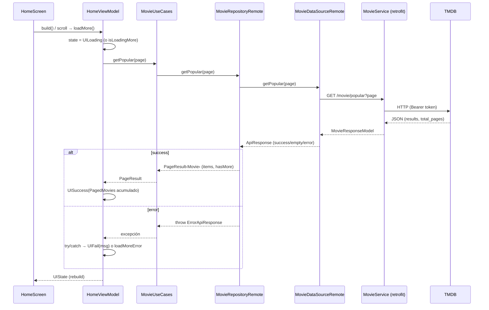

# ADR-002 — Integración real con TMDB (listado de películas)

- **Estado**: Aceptado
- **Fecha**: 2026-07-01
- **Contexto de la feature**: `specs/002-tmdb-peliculas-reales`
- **Depende de**: [ADR-001 — Arquitectura de la app](./ADR-001-arquitectura-de-la-app.md)
- **Decisores**: Equipo mobile

---

## 1. Contexto

Sobre la base arquitectónica (ADR-001) se conecta el consumo **real** de la API de TMDB:
la pantalla principal debe mostrar el listado **Popular** con datos reales (póster, título,
rating) y **scroll infinito**, y deben quedar definidas las operaciones del catálogo
(Popular, Top Rated, Detalle, Búsqueda) como casos de uso reutilizables.

## 2. Decisiones

### D1 — Autenticación con Read Access Token estático (no session_id)
- Se usa el **API Read Access Token (v4)** de TMDB como Bearer en el header `Authorization`.
- Es estático (no expira); suficiente para endpoints de **lectura** (populares, top rated, detalle, búsqueda).
- **NO** se implementa el flujo `session_id` (request_token → aprobación en navegador → session_id): ese `request_token` expira a los 60 min y el `session_id` solo sirve para **acciones de usuario** (rating/watchlist), que el ejercicio no pide.

### D2 — Token en archivo `.env` (flutter_dotenv)
- El token se lee de un **`.env`** (no versionado, en `.gitignore`) vía `flutter_dotenv`; `await dotenv.load()` en `main` antes de `runApp`.
- Plantilla en `.env.example`. `ApiConfig.tmdbToken` lo expone; `dioProvider` arma el header Bearer.

### D3 — Cliente HTTP autogenerado (retrofit)
- `MovieService` (`@RestApi`) declara los 4 endpoints; `retrofit_generator` genera la implementación.
- Acotado `retrofit ">=4.4.0 <4.9.0"` + `retrofit_generator ^9.7.0` por compatibilidad de `source_gen` con Freezed 2.x.

### D4 — Respuesta de red: `ApiResponse` + `ApiResponseHandlerMixin`
- El data source remoto envuelve cada llamada con `executeApiCall(...)`; el mixin traduce `DioException`/status a `SuccessApiResponse` / `EmptyApiResponse` / `ErrorApiResponse`.

### D5 — Modelos que **extienden** la entidad (LSP) donde la forma coincide
- `MovieModel extends Movie` (json_serializable, shape 1:1).
- `MovieDetailModel extends MovieDetail` (json_serializable + **`GenresConverter`** para `genres`).
- Regla: **extender** cuando modelo≈entidad; **espejar + mapear** cuando la forma difiere o no hay entidad. Freezed **no** puede extender, por eso estos modelos usan json_serializable.

### D6 — `MovieResponseModel` (wrapper) + `PageResult` (dominio)
- `MovieResponseModel` (Freezed) espeja la respuesta paginada (`page`, `results`, `total_pages`); no extiende (no hay entidad wrapper).
- El repositorio la transpone a **`PageResult<Movie>`** (`items`, `page`, `hasMore = page < totalPages`), que es lo que fluye al dominio.

### D7 — Géneros como enum `MovieGenre` (sin strings quemados)
- Enum de dominio con **id estable de TMDB** + etiqueta; `MovieGenre.fromId` resuelve por id (robusto a idioma), `unknown` como fallback.
- `MovieDetail.genres` es `List<MovieGenre>`; `GenresConverter` mapea `[{id,name}]` → `List<MovieGenre>`.

### D8 — Un solo provider de casos de uso con inyección manual
- `MovieUseCases` agrupa las 4 operaciones (misma responsabilidad). Un único `movieUseCasesProvider` arma la cadena manualmente: `dio → MovieService → MovieDataSourceRemote → MovieRepositoryRemote → MovieUseCases`.
- El ViewModel maneja el error con **try/catch** (el repositorio lanza en fallo).

### D9 — Paginación con scroll infinito
- Estado `PagedMovies` (items acumulados, page, hasMore, isLoadingMore, loadMoreError) dentro de `UIState.success`.
- El `HomeViewModel` carga la página 1 en `build()`, y `loadMore()` anexa la siguiente; error de página no descarta lo cargado (reintento en footer).

## 3. Diagrama de capas y dependencias

```mermaid
flowchart TB
    subgraph PRES[presentation]
      HS[HomeScreen] --> HVM[HomeViewModel]
      HVM --> UIST[UIState‹PagedMovies›]
    end
    subgraph DOM[domain]
      UC[MovieUseCases]
      REPO[MovieRepository - abstracto]
      MV[Movie] ; MD[MovieDetail] ; PR[PageResult‹T›] ; GEN[MovieGenre enum]
    end
    subgraph DATA[data]
      REPOIMP[MovieRepositoryRemote]
      DS[MovieDataSource - abstracto]
      DSR[MovieDataSourceRemote]
      SVC[MovieService - retrofit]
      MM[MovieModel extends Movie]
      MDM[MovieDetailModel extends MovieDetail]
      MRM[MovieResponseModel]
    end
    subgraph CORE[core/api]
      DIO[dioProvider] ; CFG[ApiConfig .env] ; AR[ApiResponse + mixin]
    end

    HVM --> UC --> REPO
    REPOIMP -. implementa .-> REPO
    REPOIMP --> DS
    DSR -. implementa .-> DS
    DSR --> SVC --> DIO
    DSR --> AR
    CFG --> DIO
    MM -. extends .-> MV
    MDM -. extends .-> MD
    REPOIMP --> PR
    MDM --> GEN

    classDef d fill:#e8f5e9,stroke:#43a047; classDef t fill:#e3f2fd,stroke:#1e88e5;
    classDef p fill:#fff3e0,stroke:#fb8c00; classDef c fill:#f3e5f5,stroke:#8e24aa;
    class UC,REPO,MV,MD,PR,GEN d; class REPOIMP,DS,DSR,SVC,MM,MDM,MRM t;
    class HS,HVM,UIST p; class DIO,CFG,AR c;
```

## 4. Flujo end-to-end (listado Popular + paginación)



## 5. Endpoints TMDB usados

| Requerimiento | Endpoint | Caso de uso (`MovieUseCases`) | UI en 002 |
|---------------|----------|-------------------------------|-----------|
| Popular | `GET /movie/popular` | `getPopular({page})` | ✅ pantalla principal |
| Top Rated | `GET /movie/top_rated` | `getTopRated({page})` | cableado (UI posterior) |
| Detalle | `GET /movie/{id}` | `getDetail(id)` | cableado (UI posterior) |
| Búsqueda | `GET /search/movie` | `search(query,{page})` | cableado (UI posterior) |

Imágenes de póster: `https://image.tmdb.org/t/p/w342{poster_path}` (via `ApiConfig.posterUrl`, con placeholder).

## 6. Consecuencias

**Positivas**
- Datos reales con arquitectura desacoplada; features siguientes (detalle/top rated/búsqueda) ya tienen su caso de uso listo.
- Modelos consistentes con la entidad (LSP) → sin mapeo manual de campos en el repositorio (salvo el converter de géneros y el armado de `PageResult`).
- Géneros tipados (`MovieGenre`) — sin strings quemados.
- Secreto (token) fuera del código y de git.
- Un solo provider de DI reduce ruido.

**Negativas / trade-offs**
- `retrofit` acotado `<4.9` por compatibilidad con Freezed 2.x (migrar a Freezed 3.x lo liberaría).
- Convivencia de dos estilos de modelado (json_serializable para los que extienden; Freezed para el wrapper) — decisión consciente por la restricción "Freezed no puede extender".
- El token de lectura vive en `.env` local; rotar si el repo se hace público.
- Pruebas unitarias siguen **desactivadas** (`test_disabled/`).

## 7. Validación

- `flutter analyze`: sin errores (solo `info` de estilo en el mixin de terceros; `invalid_annotation_target` suprimido para Freezed+JsonKey).
- Verificado en emulador Android: `API call successful: MovieResponseModel`; listado Popular real con pósters, título y rating; scroll infinito.

## 8. Trabajo futuro

- Pantallas de **Detalle**, **Top Rated** y **Búsqueda** (casos de uso ya disponibles).
- Reactivar/ampliar pruebas; interceptores dio (logging/errores); config por ambiente sobre `ApiConfig`.
- Localización (`language`/`region`) de los resultados.
