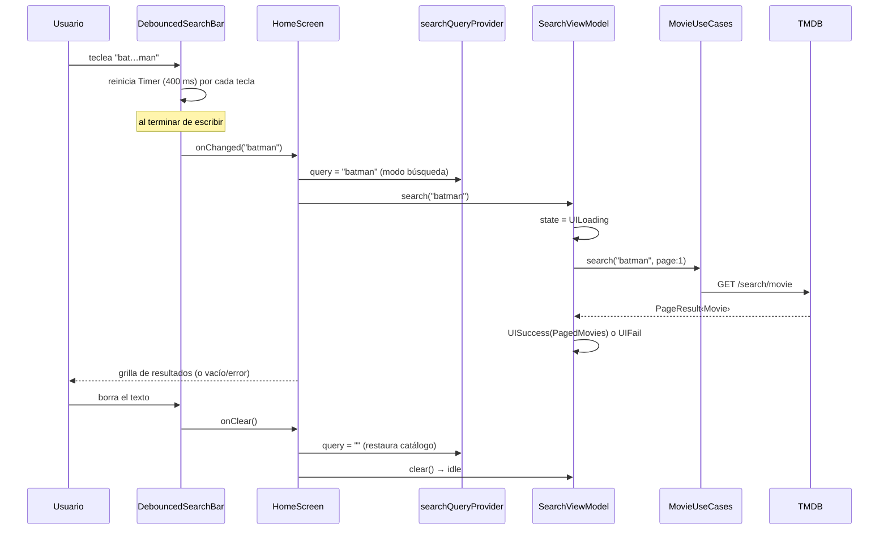

# ADR-003 — Design System (Netflix) y pantallas de catálogo, búsqueda y detalle

- **Estado**: Aceptado
- **Fecha**: 2026-07-01
- **Contexto de la feature**: `specs/003-catalogo-detalle-busqueda`
- **Depende de**: [ADR-002 — Integración real con TMDB](./ADR-002-integracion-tmdb.md) · [ADR-001 — Arquitectura de la app](./ADR-001-arquitectura-de-la-app.md)
- **Decisores**: Equipo mobile

---

## 1. Contexto

Con el consumo real de TMDB ya resuelto (ADR-002, casos de uso Popular/Top Rated/Detalle/Búsqueda
listos), esta feature construye la **capa de presentación completa** del ejercicio:

- Pantalla principal (catálogo) con **Populares** y **Mejor valoradas** como filas estilo Netflix.
- **Buscador** en la parte superior que filtra y actualiza la vista, con **debounce** para no
  disparar una petición por tecla; al limpiar/volver se restaura el catálogo por defecto.
- Pantalla de **Detalle** de película.

El requisito de escalabilidad y de "reutilizar componentes comunes entre pantallas" motiva
introducir un **Design System** propio (a nivel de `lib/`, transversal a las features) en lugar
de widgets sueltos por pantalla.

## 2. Decisiones

### D1 — Design System propio con Atomic Design, a nivel de `lib/design_system/`
- Capa **compartida** (no pertenece a ninguna feature) con jerarquía **atoms → molecules → organisms**
  + `theme/` (tokens) + barrel `design_system.dart`.
- **Agnóstico de dominio**: los componentes reciben datos primitivos/callbacks; **no importan** nada de
  `features/`. Una `MediaCard`/`MediaCarousel` sirve para película o serie.
- El mapeo `Movie → MediaCardData` (incl. `posterPath → URL`) vive del lado del llamador
  (`media_card_mapper.dart`), no dentro del Design System.

### D2 — Estética Netflix, dark-only, por tokens
- Fuente de decisión: skill `ui-ux-pro-max` (estilo "Dark Mode/OLED", paleta "Video Streaming/OTT",
  font-pairing "Modern Dark Cinema/Inter"). Único ajuste de marca: acento **rojo Netflix `#E50914`**.
- Tokens centralizados en `theme/` (`AppColors`, `AppSpacing`, `AppRadius`, `AppTypography`,
  `AppDurations`, `AppShadows`) → **sin colores/paddings quemados** fuera del Design System.
- App **dark-only** por diseño: `AppTheme.dark` en `theme`/`darkTheme`/`themeMode` (`app.dart`).
  No se bundlea Inter (se usa la familia del sistema con la misma escala; activable en 1 línea).

### D3 — Catálogo con dos colecciones paginadas independientes
- `CatalogViewModel` expone `UIState<CatalogState>` con **dos** `PagedMovies` (popular, topRated),
  cargadas en paralelo (`Future.wait`) en `build()`.
- Cada fila pagina **de forma independiente** en horizontal (scroll infinito por categoría).

### D4 — Búsqueda con debounce en el widget, orquestación en el ViewModel
- El **debounce de 400 ms** vive en el widget `DebouncedSearchBar` (Timer interno); solo expone
  callbacks (`onChanged` debounced, `onClear`). La lógica de request/estado vive en `SearchViewModel`.
- Se dispara con **≥1 carácter no vacío**; texto en blanco/espacios = "sin búsqueda".
- La búsqueda **reemplaza** la vista (modo búsqueda) y **restaura** el catálogo al limpiar/volver.
- **Modo** determinado por `searchQueryProvider` (`''` = catálogo). Estado idle = `UISuccess` vacío.

### D5 — La paginación es responsabilidad del `MediaCarousel` (no un parche externo)
- `MediaCarousel` posee el hook `onEndReached` + footer de **carga**/**reintentar**
  (`isLoadingMore`/`loadMoreFailed`/`onRetryLoadMore`). La feature ya **no** envuelve el carrusel en
  un `NotificationListener` externo (acoplamiento frágil evitado).
- Las transiciones de paginación se centralizan en `PagedMovies`
  (`fromPage`/`startLoadingMore`/`appendPage`/`failLoadingMore`).

### D6 — Guardas de correctitud en scroll infinito
- El guard de `loadMore` contempla `loadMoreError`: tras un fallo **no se auto-reintenta** en cada
  frame de scroll (evita martillar el endpoint); el reintento es **explícito** (`retryLoadMore*`).
- `SearchViewModel.loadMore` captura el término y descarta la página si cambió durante el `await`
  (búsquedas encadenadas → prevalece la última).

### D7 — Detalle con backdrop real y navegación por fluro
- `MovieDetailViewModel` (familia por `id`) → `UIState<MovieDetail>`; `MovieDetailScreen` consume
  el organismo `DetailHeader` (backdrop + póster + rating + géneros + sinopsis).
- Se añadió `backdropPath` a `MovieDetail`/`MovieDetailModel` y `ApiConfig.backdropUrl()` (w780).
- Ruta `/movie/:id` (fluro); id malformado → pantalla "Ruta no válida" (no golpea la API con id 0).

### D8 — Convención UI: DRY + widgets como clases (no `Widget _buildX`)
- Todo sub-árbol compuesto es su **propia clase de widget** (`const` donde aplica); **prohibido**
  construir widgets dentro de métodos privados/públicos. Verificado por un subagente de UI/UX.

### D9 — Helpers compartidos (DRY)
- `messageFromError` (mapeo excepción→mensaje) centralizado en `core/api/remote/error_message.dart`
  (antes duplicado en cada ViewModel).
- Se retiró el `HomeViewModel`/`MovieTile`/`PosterImage` legado (código muerto tras el refactor).

## 3. Estructura del Design System y dependencias

```mermaid
flowchart TB
    subgraph FEAT[features/home/presentation]
      HS[HomeScreen] --> CV[CatalogView]
      HS --> SRV[SearchResultsView]
      DSCR[MovieDetailScreen]
      CVM[CatalogViewModel] ; SVM[SearchViewModel] ; DVM[MovieDetailViewModel]
      MAP[media_card_mapper] ; PM[PagedMovies]
    end
    subgraph DS[lib/design_system - agnóstico de dominio]
      subgraph ORG[organisms]
        CSAB[CatalogSearchAppBar] ; MC[MediaCarousel] ; DH[DetailHeader]
      end
      subgraph MOL[molecules]
        DSB[DebouncedSearchBar] ; MCARD[MediaCard] ; ES[EmptyState] ; ERS[ErrorState]
      end
      subgraph ATO[atoms]
        AT[AppText] ; RB[RatingBadge] ; CHIP[AppChip] ; IB[AppIconButton] ; SP[AppSpinner] ; SH[Shimmer]
      end
      subgraph THM[theme - tokens]
        COL[AppColors] ; SPC[AppSpacing] ; TYP[AppTypography] ; RAD[AppRadius]
      end
    end

    CV --> CVM ; SRV --> SVM ; DSCR --> DVM
    CV --> MC ; HS --> CSAB ; SRV --> MCARD ; DSCR --> DH
    CVM --> PM ; SVM --> PM ; MAP --> MCARD
    CSAB --> DSB ; MC --> MCARD ; DH --> CHIP
    ORG --> MOL --> ATO --> THM

    classDef p fill:#fff3e0,stroke:#fb8c00; classDef d fill:#e3f2fd,stroke:#1e88e5;
    class HS,CV,SRV,DSCR,CVM,SVM,DVM,MAP,PM p;
    class CSAB,MC,DH,DSB,MCARD,ES,ERS,AT,RB,CHIP,IB,SP,SH,COL,SPC,TYP,RAD d;
```

## 4. Flujo end-to-end (búsqueda con debounce)



## 5. Pantallas y componentes reutilizados

| Pantalla | Requerimiento | Organismos/moléculas del Design System |
|----------|---------------|----------------------------------------|
| **Catálogo (Home)** | Popular + Top Rated, scroll infinito | `CatalogSearchAppBar`, `MediaCarousel` (+footer), `MediaCard`, `EmptyState`, `ErrorState` |
| **Búsqueda** | filtrar por nombre con debounce | `DebouncedSearchBar` (en `CatalogSearchAppBar`), `MediaCard`, `EmptyState`, `ErrorState`, `AppSpinner` |
| **Detalle** | imagen, rating, géneros, sinopsis | `DetailHeader` (backdrop+scrim+póster+`RatingBadge`+`AppChip`), `AppText` |

## 6. Consecuencias

**Positivas**
- Componentes **reutilizables** y consistentes entre pantallas; nueva pantalla = componer, no reescribir.
- Identidad visual coherente por **tokens** (dark Netflix); cambiar la marca es tocar `theme/`.
- Design System agnóstico → preparado para **Series** sin reescribir UI (solo faltaría la capa de datos `/tv/*`).
- Paginación robusta: sin martilleo del endpoint ante fallo, con feedback de carga/reintento.
- MVVM intacto: los widgets no contienen lógica de red; el debounce es presentación pura.

**Negativas / trade-offs**
- Modificar `MediaCarousel` para poseer la paginación acopla el organismo al patrón de scroll infinito
  (a cambio de eliminar el `NotificationListener` frágil en la feature) — se consideró la altitud correcta.
- El estado idle de búsqueda se modela como `UISuccess` vacío (depende de `searchQueryProvider` como
  guardia externa); un `UIState.idle` propio sería más explícito a futuro.
- La fuente Inter no se bundlea (se usa la del sistema con la misma escala).

## 7. Validación

- `flutter analyze`: sin errores nuevos (solo `info` de estilo preexistentes en el mixin de core).
- **18/18 pruebas** verdes: unit de los ViewModels (catálogo/paginación, búsqueda con debounce y
  encadenamiento, detalle) + widget (debounce real, catálogo, detalle, navegación listado↔detalle↔volver).
- Verificación de calidad UI/UX (tokens, reutilización, widgets como clases, a11y) **aprobada** por
  subagente especializado.
- Revisión de código (code-review): 8 hallazgos (correctitud + DRY) **corregidos**.
- Verificado en **emulador Android**: catálogo real con pósters/rating y tema Netflix; `API call successful`.

## 8. Trabajo futuro

- Dominio de **Series** (endpoints `/tv/*`) reutilizando el Design System.
- Persistencia de **favoritos/watchlist**; bundlear la fuente Inter.
- Modelar un `UIState.idle` explícito para la búsqueda; hero transition póster→detalle.
